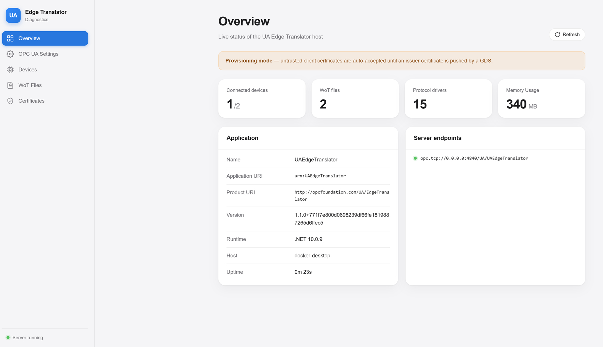
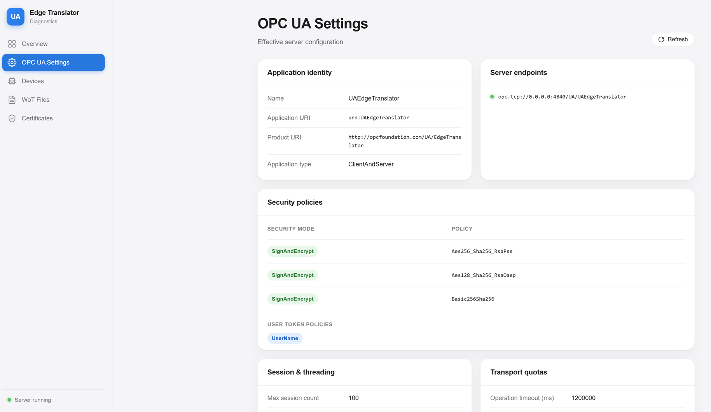
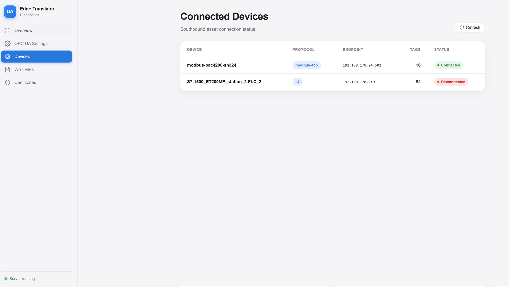
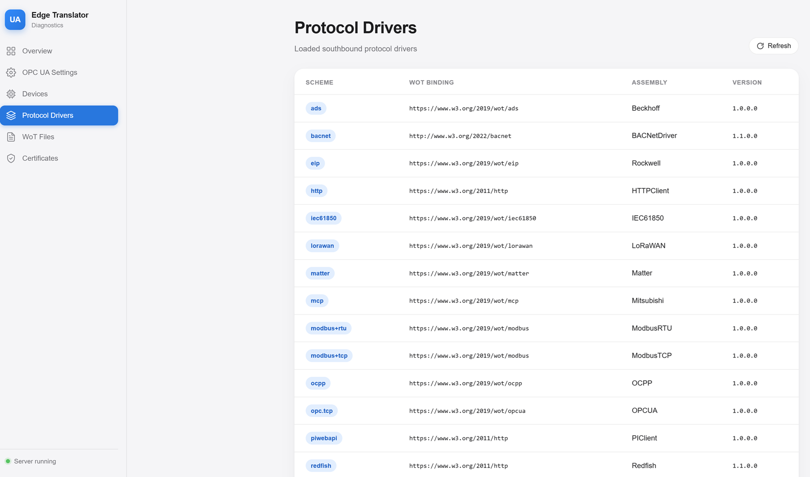
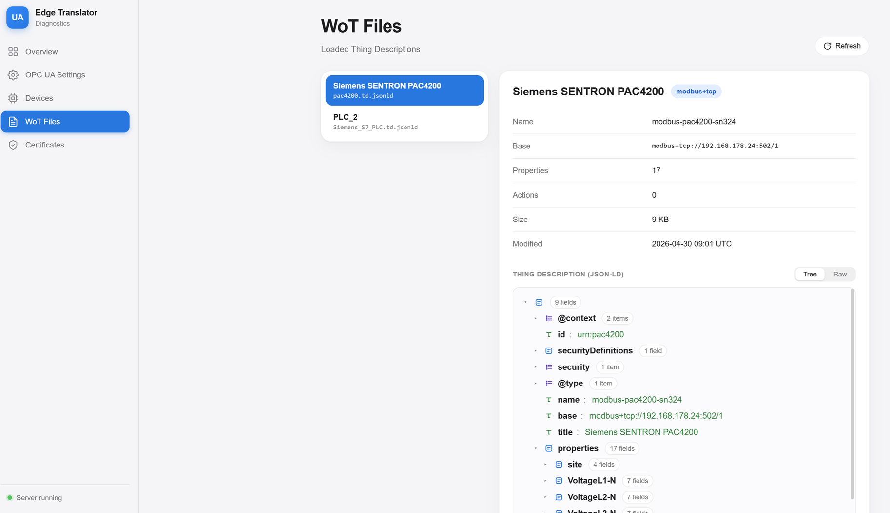
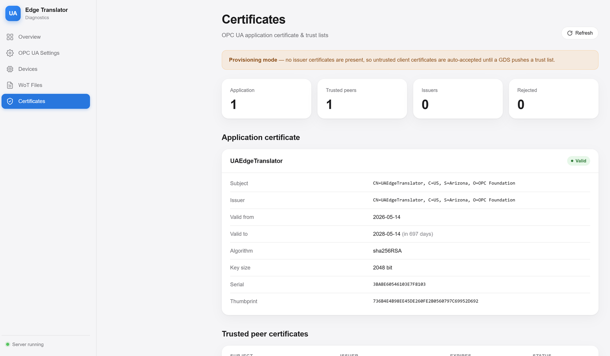
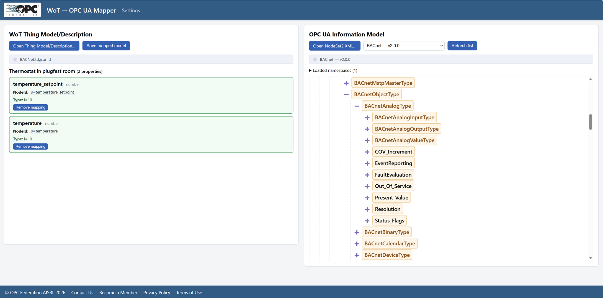

# UA Edge Translator

## CI, Code Quality and Build Status

[](https://github.com/OPCFoundation/UA-EdgeTranslator/actions/workflows/ci.yml)
[](https://github.com/OPCFoundation/UA-EdgeTranslator/actions/workflows/codeql.yml)
[](https://github.com/OPCFoundation/UA-EdgeTranslator/actions/workflows/docker-publish.yml)
[](https://github.com/OPCFoundation/UA-EdgeTranslator/actions/workflows/docker-publish-wotmapper.yml)
[](https://github.com/OPCFoundation/UA-EdgeTranslator/actions/workflows/driver-pack.yml)
[](https://github.com/OPCFoundation/UA-EdgeTranslator/actions/workflows/helm-publish.yml)

## Table of Contents

- [Introduction](#introduction)
- [How It Works](#how-it-works)
- [Star History](#star-history)
- [Supported Southbound Asset Interfaces (Protocol Drivers)](#supported-southbound-asset-interfaces-protocol-drivers)
- [Installation](#installation)
- [Running UA Edge Translator from a Docker environment](#running-ua-edge-translator-from-a-docker-environment)
- [Running UA Edge Translator from a Kubernetes environment](#running-ua-edge-translator-from-a-kubernetes-environment)
- [Running UA Edge Translator from Azure IoT Edge/Hub](#running-ua-edge-translator-from-azure-iot-edgehub)
- [Mandatory Environment Variables](#mandatory-environment-variables)
- [Optional Environment Variables](#optional-environment-variables)
- [Provisioning](#provisioning)
- [Operation](#operation)
- [Diagnostics Dashboard (Web UI)](#diagnostics-dashboard-web-ui)
- [How to build your own Protocol Driver](#how-to-build-your-own-protocol-driver)
- [Protocol driver allow-list (trust manifest)](#protocol-driver-allow-list-trust-manifest)
- [Generating WoT Thing Descriptions from PLC Engineering Tools](#generating-wot-thing-descriptions-from-plc-engineering-tools)
- [Generating a Thing Description for a Fixed-Function Asset](#generating-a-thing-description-for-a-fixed-function-asset)
- [Mapping WoT Properties to OPC UA Information Model Types (UA-WoTMapper)](#mapping-wot-properties-to-opc-ua-information-model-types-ua-wotmapper)
- [Threat Model and Security Considerations](#threat-model-and-security-considerations)

## Introduction

An standards-based and containerized industrial connectivity edge application translating from many proprietary protocols to [OPC UA](https://opcfoundation.org/) leveraging the [W3C Web of Things (WoT)](https://www.w3.org/WoT/) thing descriptions via the [WoT-Connectivity specification](https://reference.opcfoundation.org/WoT/v100/docs/), version 1.02. Data transformation into OPC UA [Companion Specs](https://opcfoundation.org/about/opc-technologies/opc-ua/ua-companion-specifications/) is also supported. Thing Descriptions can be easily edited using the [Eclipse Foundation's edi{TD}or](https://eclipse-editdor.github.io/editdor/), or automatically generated using AI. UA Edge Translator runs on both ARM and X64 architectures, it runs on both Windows and Linux and it runs in both Docker and Kubernetes environments.

## How It Works

UA Edge Translator solves the common "brownfield" use case of connecting disparate industrial assets with many different interfaces and translates their data into an OPC UA information model (ideally to one of the [standardized companion specifications](https://opcfoundation.org/developer-tools/documents/) from the [UA Cloud Library](https://uacloudlibrary.opcfoundation.org/)), enabling processing of the assets' data either on the edge or in the cloud leveraging a normalized, IEC standard (OPC UA) data format. This accelerates Industrial IoT projects and saves cost since the data doesn't need to be normalized in the cloud and makes use of the OT expertise often only found on-premises. For defining a mapping from the proprietary data format to OPC UA, the Web of Things (WoT) Thing Description schema (JSON-LD-based) is used. Additionally, the mechanism to provide the schema to the UA Edge Translator is also leveraging OPC UA. Therefore, for the first time, OPC UA is used for both the control and data plane for industrial connectivity, while previous solutions only used OPC UA for the data plane and a proprietary REST interface for the control plane.

## Star History

<a href="https://www.star-history.com/?repos=OPCFoundation%2FUA-EdgeTranslator&type=date&legend=top-left">
 <picture>
   <source media="(prefers-color-scheme: dark)" srcset="https://api.star-history.com/chart?repos=OPCFoundation/UA-EdgeTranslator&type=date&theme=dark&legend=top-left&sealed_token=i9LpD90-foEgyzYnbV43h33tLhc4YMyrT5zaOS1RaW324gV5NDwdzHjC1gRL_0HKRUbMZT52y2EgpOoiMhfaxFnLm406LAqdf_jBEFC2PG7-RQxuaiITzw" />
   <source media="(prefers-color-scheme: light)" srcset="https://api.star-history.com/chart?repos=OPCFoundation/UA-EdgeTranslator&type=date&legend=top-left&sealed_token=i9LpD90-foEgyzYnbV43h33tLhc4YMyrT5zaOS1RaW324gV5NDwdzHjC1gRL_0HKRUbMZT52y2EgpOoiMhfaxFnLm406LAqdf_jBEFC2PG7-RQxuaiITzw" />
   
 </picture>
</a>

## Supported Southbound Asset Interfaces (Protocol Drivers)

The following southbound asset interfaces (a.k.a. protocol drivers) are supported:

* Modbus TCP
* Modbus RTU
* OPC UA
* OPC DA (a.k.a. OPC Classic)
* HTTP
* Siemens S7 Comm
* Rockwell CIP (Ethernet/IP)
* Beckhoff ADS (TwinCAT)
* LoRaWAN
* Matter
* OCPP (Open Charge Point Protocol) V1.6J
* OCPP (Open Charge Point Protocol) V2.1 (experimental)
* Mitsubishi MC Protocol (experimental)
* Aveva PI (experimental)
* BACNet (experimental)
* IEC61850 (experimental)
* DMTF Redfish (experimental)

Other southbound asset interfaces can easily be added by implementing the IAsset interface (for runtime interaction with the asset) as well as the IProtocolDriver interface (for asset onboarding). 

There is also a tool provided (UA-WoTGenerator) that can convert from an OPC UA nodeset file (with instance variable nodes defined in it), an AutomationML file, a Beckhoff TwinCAT module class file, a Rockwell Studio 5000 tag CSV export, an Asset Admin Shell file, or a Siemens TIA Portal project file (via TIA Openness) to a WoT Thing Model file. See [Generating WoT Thing Descriptions from PLC Engineering Tools](#generating-wot-thing-descriptions-from-plc-engineering-tools) below for details.

Additionally, a browser-based tool (UA-WoTMapper) is provided that lets you interactively map the properties of a WoT Thing Model onto the types of an OPC UA information models via drag & drop. See [Mapping WoT Properties to OPC UA Information Models (UA-WoTMapper)](#mapping-wot-properties-to-opc-ua-companion-specifications-ua-wotmapper) below for details.

## Installation

UA Edge Translator is available as a pre-built Docker container (supporting both AMD64 and ARM64 CPUs) directly from GitHub and will run on any Docker- or Kubernetes-enabled edge device. See "Packages" in this repo for details.

> **Note**: Since BACNet uses UDP messages, BACNet support is limited to running UA Edge Translator natively or with the --net=host argument within a Docker container!

> **Note**: Network discovery for Rockwell PLCs only works when running UA Edge Translator natively or with the --net=host argument within a Docker container!

> **Note**: The LoRaWAN Network Server is available on port 5000 (not secure) and port 5001 (secure), which needs to be mapped to the Docker host for access. If you need a LoRaWAN Gateway, you can use the open-source [Basic Station](https://github.com/lorabasics/basicstation) together with a [LoRaWAN HAT for Raspberry Pi](https://www.waveshare.com/wiki/SX1302_LoRaWAN_Gateway_HAT).

> **Note**: The OCPP Central System is available on port 19520 (not secure) and on port 19521 (secure), which needs to be mapped to the Docker host for access.

> **Note**: Since Matter uses BluetoothLE and mDNS as the underlying network protocol for commissioning, Matter support is limited to running UA Edge Translator natively or with the --network=host argument as well as with the `-v /run/dbus:/run/dbus:ro` argument and, depending on your Linux distro, `--cap-add=NET_ADMIN`, within a Docker container! Also, if you are using the BlueZ stack on Linux, make sure that experimental features are enabled since Matter uses some Bluetooth features that are not enabled by default in this stack.

> **Note**: OPC DA (OLE for Process Control Data Access) is a legacy protocol that relies on COM/DCOM and its support is limited to running UA Edge Translator natively on Windows on x86 CPUs and the OPC DA server must be located on the same machine as UA Edge Translator (i.e. no DCOM support).

> **Note**: For testing the Matter asset interface, you will also need to create a Thread network using an OpenThread Border Router (OTBR). An open-source OTBR is available [here](https://openthread.io/guides/border-router) and runs on a Raspberry Pi equipped with a Thread radio USB dongle, the setup instructions are [here](https://github.com/make2explore/Open-Thread-Border-Router-on-RaspberryPi). If you need a Matter commissioning QR-code scanner/decoder, there is an online one [here](https://zxing.org/w/decode.jspx).

> **Note**: The Modbus RTU interface requires access to a serial port on the host system. When running UA Edge Translator in a Docker container, make sure to map the serial port device into the container using the --device argument, e.g. `-v /dev/ttyUSB1:/dev/ttyUSB1`.

> **Note**: Avoid `--privileged` in production deployments — it disables the user namespace, capability set, and seccomp/AppArmor confinement that the rest of the hardening relies on.

## Running UA Edge Translator from a Docker environment

```
# 1) Create a named volume for drivers
docker volume create translator_drivers

# 2) Copy drivers from the driver-pack image into the volume
docker run --rm -v translator_drivers:/out ghcr.io/opcfoundation/ua-edgetranslator-drivers:main /bin/sh -c 'cp -a /drivers/. /out/'

# 3) Run UA Edge Translator with the drivers volume mounted to /app/drivers
docker run -d --name ua-edge-translator -v translator_drivers:/app/drivers -e OPCUA_USERNAME="REPLACE_ME" -e OPCUA_PASSWORD="REPLACE_ME" -p 4840:4840 ghcr.io/opcfoundation/ua-edgetranslator:main
```

In addition, the following folders within the Docker container store certificates, secrets and settings and should be mapped and persisted (-v argument in Docker command line) to the Docker host to encrypted folders, e.g. protected folders using BitLocker:
* `/app/logs` (log files)
* `/app/pki` (certificates and keys)
* `/app/settings` (WoT Thing Descriptions)
* `/app/nodesets` (OPC UA nodesets for referenced companion specifications)
* `/app/drivers` (protocol driver DLLs, see above)

E.g. -v c:/uaedgetranslator/pki:/app/pki, etc.

Client certificates need to be manually moved from the /pki/rejected/certs folder to the /pki/trusted/certs folder to trust an OPC UA client trying to connect.

## Running UA Edge Translator from a Kubernetes environment

The recommended way to deploy UA Edge Translator on Kubernetes is the official Helm chart under [deploy/helm/ua-edgetranslator](deploy/helm/ua-edgetranslator/). It renders the same resource set as the manifest below, but parameterises the namespace, images, credentials, persistence, service exposure, security context, driver-pack rollout, RBAC and NetworkPolicy — so non-trivial deployments no longer need to fork the manifest. By default it uses a `ClusterIP` service exposing only the OPC UA port and `PersistentVolumeClaim` persistence.

Provision the OPC UA credentials `Secret` out-of-band, then install the chart from the OCI registry:

```
kubectl create namespace ua-edgetranslator
kubectl -n ua-edgetranslator create secret generic ua-edgetranslator-credentials \
    --from-literal=OPCUA_USERNAME='<username>' \
    --from-literal=OPCUA_PASSWORD='<password>'

helm install ua-edgetranslator \
    oci://ghcr.io/opcfoundation/charts/ua-edgetranslator \
    --namespace ua-edgetranslator \
    --set credentials.existingSecret=ua-edgetranslator-credentials
```

See the [chart README](deploy/helm/ua-edgetranslator/README.md) for provisioning the credentials `Secret`, pinning driver-pack allow-list `ConfigMap`s, RBAC, persistence options, the full values reference, and a migration guide from the manifest.

### Kubernetes manifest file

A single-file Kubernetes manifest is also provided: [UA-EdgeTranslator.yaml](UA-EdgeTranslator.yaml). It creates a dedicated `ua-edgetranslator-namespace`, deploys UA Edge Translator with an init container that copies the protocol drivers from the driver-pack image into a shared volume, and exposes the OPC UA, LoRaWAN and OCPP ports via a `LoadBalancer` service.
Apply it to your cluster directly from this repository with:

```
kubectl apply -f https://raw.githubusercontent.com/OPCFoundation/UA-EdgeTranslator/main/UA-EdgeTranslator.yaml
```

Before applying, review the manifest and consider adjusting the following to suit your environment:
* The `OPCUA_USERNAME` and `OPCUA_PASSWORD` environment variables (consider using a Kubernetes `Secret` instead of inline values for production).
* The `hostPath` entries for the `settings`, `pki`, `logs` and `nodesets` volumes — these default to paths under `/mnt/c/K3s/UAEdgeTranslator/` (suitable for K3s on WSL) and should be changed to persistent locations on your nodes (or replaced with `PersistentVolumeClaims`).
* The exposed service ports if you do not need LoRaWAN (5000/5001) or OCPP (19520/19521).

## Running UA Edge Translator from Azure IoT Edge/Hub

UA Edge Translator can be deployed to an [Azure IoT Edge](https://learn.microsoft.com/azure/iot-edge/) device managed by an [Azure IoT Hub](https://learn.microsoft.com/azure/iot-hub/). A ready-to-use deployment manifest is provided in this repository: [deployment.template.json](deployment.template.json). It deploys:

* The standard Azure IoT Edge system modules (`$edgeAgent` and `$edgeHub`, both pinned to the 1.5 LTS tag).
* An `uaedgetranslatordrivers` module that runs once (`restartPolicy: never`) and copies the signed protocol drivers from the `ghcr.io/opcfoundation/ua-edgetranslator-drivers:main` image into a shared Docker named volume.
* The `uaedgetranslator` module itself, which mounts that shared drivers volume into `/app/drivers` and exposes the OPC UA (4840), LoRaWAN (5000/5001) and OCPP (19520/19521) ports on the host.
* The Microsoft [OPC Publisher](https://github.com/Azure/Industrial-IoT/blob/release/2.9.16/docs/opc-publisher/readme.md) module (`mcr.microsoft.com/iotedge/opc-publisher:2.9`), which connects to the OPC UA server exposed by UA Edge Translator at `opc.tcp://uaedgetranslator:4840` and forwards the translated OPC UA telemetry **to the local `$edgeHub` module** (not directly to IoT Hub). `$edgeHub` then routes it upstream via `FROM /messages/modules/opcpublisher/* INTO $upstream` and applies its [store-and-forward](https://learn.microsoft.com/azure/iot-edge/offline-capabilities) buffer (`timeToLiveSecs = 7200`) when the cloud link is down. The manifest does **not** set `--mqc` / `--ec` / any other external broker connection string, so the IoT Hub SDK `ModuleClient` inside OPC Publisher uses the auto-injected `EdgeHubConnectionString` and goes through `edgeHub`.

### Prerequisites

* An [Azure IoT Hub](https://learn.microsoft.com/azure/iot-hub/iot-hub-create-through-portal) instance.
* An [IoT Edge device](https://learn.microsoft.com/azure/iot-edge/how-to-provision-single-device-linux-symmetric) registered with that IoT Hub and running the [Azure IoT Edge 1.5 LTS](https://learn.microsoft.com/azure/iot-edge/support) runtime on a Linux host (AMD64 or ARM64).
* The [Azure CLI](https://learn.microsoft.com/cli/azure/install-azure-cli) with the [`azure-iot` extension](https://learn.microsoft.com/cli/azure/iot) installed (`az extension add --name azure-iot`).

### Deploy with the Azure CLI

1. Edit [deployment.template.json](deployment.template.json) and replace the `OPCUA_USERNAME` / `OPCUA_PASSWORD` placeholder values with the credentials you want OPC UA clients to use when connecting to UA Edge Translator. For production, store these in [Azure Key Vault](https://learn.microsoft.com/azure/key-vault/) or use the [IoT Edge secret injection pattern](https://learn.microsoft.com/azure/iot-edge/how-to-manage-device-secrets) instead of inlining them in the manifest.
2. Optionally add any of the [Optional Environment Variables](#optional-environment-variables) (for example `UACLURL`, `LICENSE_KEY` or `WOT_MAX_FILE_BYTES`) to the `env` block of the `uaedgetranslator` module.
3. Apply the deployment to your IoT Edge device:

```
az iot edge set-modules `
  --hub-name <your-iot-hub-name> `
  --device-id <your-iot-edge-device-id> `
  --content ./deployment.template.json
```

4. Verify on the IoT Edge device that all four modules are reported as `running` (note that `uaedgetranslatordrivers` will report as exited / stopped once it has copied the drivers — this is expected because its `restartPolicy` is `never`):

```
sudo iotedge list
```

### Deploy from the Azure portal

You can also apply the manifest from the portal:

1. Navigate to your IoT Hub → **Devices** → select your IoT Edge device → **Set Modules**.
2. Choose **Review + create** → **Load from a JSON file** and pick [deployment.template.json](deployment.template.json).
3. Update the `OPCUA_USERNAME` / `OPCUA_PASSWORD` environment variables under the `uaedgetranslator` module before submitting.

### Persistent storage on the IoT Edge host

The manifest creates Docker named volumes (`uaedgetranslator-drivers`, `uaedgetranslator-settings`, `uaedgetranslator-pki`, `uaedgetranslator-logs`, `uaedgetranslator-nodesets`, `opcpublisher-pn`, `opcpublisher-pki`, `opcpublisher-logs`) that survive container restarts and module updates. For production deployments, consider the following:

* Replace the named volumes with bind mounts to encrypted folders on the host (e.g. LUKS-encrypted partitions) by adjusting the `Mounts` entries in the `createOptions` field — the `/app/pki` folders (for both UA Edge Translator and OPC Publisher) in particular contain private keys and **must** be protected.
* Client certificates need to be manually moved from `/app/pki/rejected/certs` to `/app/pki/trusted/certs` inside the container (`docker exec` into the `uaedgetranslator` module) to trust an OPC UA client trying to connect. Because OPC Publisher acts as an OPC UA *client* against UA Edge Translator, its certificate from `opcpublisher-pki/own/certs` must also be copied into UA Edge Translator's trusted store before subscriptions can be established.

### Configuring OPC Publisher

OPC Publisher reads its subscription configuration from `/app/pn/publishednodes.json`. Before applying the manifest, populate the `opcpublisher-pn` volume on the IoT Edge host with a `publishednodes.json` file describing which OPC UA nodes to subscribe to on UA Edge Translator. A minimal example:

```json
[
  {
    "EndpointUrl": "opc.tcp://uaedgetranslator:4840",
    "UseSecurity": true,
    "OpcAuthenticationMode": "UsernamePassword",
    "OpcAuthenticationUsername": "REPLACE_ME",
    "OpcAuthenticationPassword": "REPLACE_ME",
    "OpcNodes": [
      {
        "Id": "nsu=http://opcfoundation.org/UA/WoTCon/;s=YourAssetVariable",
        "OpcSamplingInterval": 1000,
        "OpcPublishingInterval": 1000
      }
    ]
  }
]
```

The `EndpointUrl` uses the module's hostname (`uaedgetranslator`) because all IoT Edge modules on the same device share a Docker bridge network and can resolve each other by module name. The credentials must match the `OPCUA_USERNAME` / `OPCUA_PASSWORD` configured for UA Edge Translator. See the [OPC Publisher configuration schema](https://github.com/Azure/Industrial-IoT/blob/release/2.9.16/docs/opc-publisher/readme.md#configuration-schema) and [`publishednodes.json` reference](https://github.com/Azure/Industrial-IoT/blob/release/2.9.16/docs/opc-publisher/readme.md#configuration-via-configuration-file) for the full schema.

To populate the volume, SSH to the IoT Edge device and run:

```
sudo docker volume create opcpublisher-pn
sudo cp publishednodes.json /var/lib/docker/volumes/opcpublisher-pn/_data/publishednodes.json
sudo chown 1000:1000 /var/lib/docker/volumes/opcpublisher-pn/_data/publishednodes.json
```

Alternatively, OPC Publisher exposes IoT Hub direct methods (`PublishNodes_V1`, `UnpublishNodes_V1`, `GetConfiguredNodesOnEndpoint_V1`, …) so the configuration can be managed from the cloud after the module starts. See the [OPC Publisher direct methods API reference](https://github.com/Azure/Industrial-IoT/blob/release/2.9.16/docs/opc-publisher/directmethods.md) and [command-line options reference](https://github.com/Azure/Industrial-IoT/blob/release/2.9.16/docs/opc-publisher/commandline.md).

### Notes

* The `uaedgetranslatordrivers` module has `restartPolicy: never` and `startupOrder: 0` so it runs once at deployment time, copies the signed drivers into the shared volume, and then exits cleanly. The `uaedgetranslator` module starts afterwards (`startupOrder: 1`) and consumes the drivers from the same volume. OPC Publisher starts last (`startupOrder: 2`) so the OPC UA endpoint is reachable when it tries to connect.
* Because the images on `ghcr.io/opcfoundation` and `mcr.microsoft.com` are public, no `registryCredentials` entry is required. If you mirror them into [Azure Container Registry](https://learn.microsoft.com/azure/container-registry/) or another private registry, add the credentials under `$edgeAgent → settings → registryCredentials`.
* The same caveats that apply to the Docker deployment apply here too — see the notes at the top of the README about BACNet, Matter, Rockwell discovery and Modbus RTU, which all require `--network=host` (which IoT Edge does not expose by default) or device pass-through. To enable host networking for those protocols, add `"NetworkMode": "host"` to the module's `createOptions.HostConfig`.
* The OPC Publisher command line in the manifest uses `--aa` (auto-accept untrusted certificates) for ease of first-time setup. **Remove `--aa` for production** and instead exchange certificates manually between OPC Publisher (`opcpublisher-pki`) and UA Edge Translator (`uaedgetranslator-pki`).
* The manifest sets `IGNORE_PROVISIONING_MODE=1` on the `uaedgetranslator` module because OPC Publisher does **not** support the OPC UA GDS Server Push provisioning mechanism, so it cannot inject an issuer certificate to take UA Edge Translator out of provisioning mode. Without this flag, OPC Publisher would be unable to browse or subscribe to the WoT-Connectivity-related OPC UA nodes. Note that with this flag set, OPC Publisher's client certificate is **not** auto-accepted (see [Provisioning mode, `IGNORE_PROVISIONING_MODE` and client-certificate trust](#provisioning-mode-ignore_provisioning_mode-and-client-certificate-trust)): on first connection it lands in the `uaedgetranslator-pki` `rejected/certs` store and must be trusted once — move it to `trusted/certs` (manually or with the **Trust** button on the [Certificates dashboard](#certificates-certificates)). **Remove `IGNORE_PROVISIONING_MODE` for production** if you have another way to provision UA Edge Translator (e.g. manually copying an issuer certificate into the `uaedgetranslator-pki` volume at `issuer/certs`).

## Mandatory Environment Variables

* `OPCUA_USERNAME` - OPC UA username to connect to UA Edge Translator. **The server refuses to start if this is missing or empty.**
* `OPCUA_PASSWORD` - OPC UA password to connect to UA Edge Translator. **The server refuses to start if this is missing or empty.**

## Optional Environment Variables

* `APP_NAME` - OPC UA application name to use. Default is UAEdgeTranslator.
* `UACLURL` - UA Cloud Library URL (e.g. https://uacloudlibrary.opcfoundation.org or https://cloudlib.cesmii.net).
* `UACLUsername` - UA Cloud Library username.
* `UACLPassword` - UA Cloud Library password.
* `OPCUA_CLIENT_USERNAME` - OPC UA client username to connect to an OPC UA asset.
* `OPCUA_CLIENT_PASSWORD` - OPC UA client password to connect to an OPC UA asset.
* `DISABLE_ASSET_CONNECTION_TEST` - Set to `1` to disable the connection test when mapping an asset to OPC UA.
* `IGNORE_PROVISIONING_MODE` - Set to `1` to ignore provisioning mode and allow access to WoT-Connectivity-related OPC UA nodes in the address space. This also takes manual control of client-certificate trust: while the issuer store is empty, untrusted client certificates are **rejected** (not auto-accepted) and must be trusted manually. See [Provisioning mode, `IGNORE_PROVISIONING_MODE` and client-certificate trust](#provisioning-mode-ignore_provisioning_mode-and-client-certificate-trust).
* `OPC_UA_GDS_ENDPOINT_URL` - The endpoint URL of an OPC UA Global Discovery Server on the network, which will then be used during network discovery.
* `DISABLE_TLS` - Set to `1` to turn off TLS for OCPP and LoRaWAN connections.
* `LICENSE_KEY` - Activation key required by the OPC UA `License` write method. If unset, license activation requests are rejected with `BadNotSupported`. The configured value is compared in constant time against the value written by the OPC UA client.
* `WOT_MAX_FILE_BYTES` - Maximum size (in bytes) accepted per upload through the OPC UA File API (WoT Thing Descriptions and nodeset uploads). Defaults to `5242880` (5 MB). Uploads exceeding the cap are rejected with `BadOutOfMemory` so a malicious or misconfigured client cannot exhaust server memory.
* `DRIVER_ALLOWLIST_OIDC_ISSUER` - Fulcio OIDC issuer the driver allow-list signing certificate must come from. Defaults to `https://token.actions.githubusercontent.com`. See [Protocol driver allow-list (trust manifest)](#protocol-driver-allow-list-trust-manifest).
* `DRIVER_ALLOWLIST_OIDC_REPO` - GitHub `owner/repo` whose `.github/workflows/driver-pack.yml` is allowed to sign the driver allow-list manifest. Defaults to `OPCFoundation/UA-EdgeTranslator`. The loader accepts both `refs/heads/main` and `refs/tags/v*` runs of that workflow file. Override this when you publish your own driver pack from a fork.
* `DRIVER_ALLOWLIST_OFFLINE_MODE` - Set to `allow-hash-only` to permit hash-only enforcement of the driver allow-list when the Sigstore bundle is missing or cannot be verified (intended for air-gapped deployments). Unset by default, meaning the loader is **fail-closed** and refuses to load any driver if the manifest is not signed and verified.
* REDFISH_USERNAME - Username for authentication to Redfish assets.
* REDFISH_PASSWORD - Password for authentication to Redfish assets.

## Provisioning
UA Edge Translator supports provisioning via GDS Server Push functionality as described in part 12 of the OPC UA specification. Until an issuer certificate is provided in the issuer certificate store of UA Edge Translator, it is in provisioning mode and **access to the WoT-Connectivity-related OPC UA nodes and mapped asset tags in its address space is restricted**. An issuer certificate can be provided as part of the GDS Server Push mechanism or by manually copying a certificate into the issuer certificate store found in the /app/pki/issuer/certs directory. During provisioning, all client certificates are auto-accepted by UA Edge Translator, but afterwards they need to be manually trusted by copying them from the rejected certificate store to the trusted certificate store (or with the **Trust** button on the [Certificates dashboard](#certificates-certificates)), unless of course the certificates were already trusted (for example because they were provided by the GDS Server Push mechanism). These stores can also be found in the /app/pki/ folder.

### Understanding provisioning mode, `IGNORE_PROVISIONING_MODE` and client-certificate trust

Two independent inputs determine the server's behaviour: whether the **issuer certificate store** (`pki/issuer/certs`) is empty, and whether the **`IGNORE_PROVISIONING_MODE`** environment variable is set. They control two separate things — **asset-tag access** (whether OPC UA clients can read/write mapped tags) and **untrusted client-certificate handling** (whether a client whose certificate is not yet trusted is accepted or rejected):

| Issuer certs present | `IGNORE_PROVISIONING_MODE` | Asset-tag access | Untrusted client certificates |
| --- | --- | --- | --- |
| No (empty store) | unset | **Blocked** | **Auto-accepted** so a GDS can push the first issuer/trust list |
| No (empty store) | set (`1`) | **Allowed** | **Rejected** - OPC UA validates against the trusted store and the CRL |
| Yes | unset | **Allowed** | **Rejected** - OPC UA validates against the trusted/issuer stores and the CRL |
| Yes | set (`1`) | **Allowed** | **Rejected** - OPC UA validates against the trusted/issuer stores and the CRL |

Key points:

* Setting `IGNORE_PROVISIONING_MODE=1` means **"I am taking manual control of trust."** It unblocks asset-tag access *and* turns off the provisioning-mode auto-accept of untrusted client certificates, so the server is never simultaneously wide open to every client and serving tags. This is a security hardening change from earlier versions of UA Edge Translator, where the override unblocked tag access while leaving every client auto-accepted.
* When an untrusted client is rejected, its certificate is placed in `pki/rejected/certs`. Trust it by moving it to `pki/trusted/certs` — either manually, or with the **Trust** button on the [Certificates dashboard](#certificates-certificates). The running server picks up the change on the next connection attempt; no restart is required.
* Once any issuer certificate is present, untrusted clients are always rejected regardless of the override; trust is then governed by the on-disk trusted/issuer stores and their CRLs (the SDK's Part 12 validation), with `AutoAcceptUntrustedCertificates` left `false` in the configuration (the default).


## Operation

UA Edge Translator can be controlled through the use of just 2 OPC UA methods (and OPC UA file transfer functionality) readily available through the OPC UA server interface built in. The methods are:

* CreateAsset(assetName) - Creates an asset node and an OPC UA File API node below the asset node (which can be used to upload the WoT Thing Description), returning the node ID of the newly created asset node on success.
* DeleteAsset(assetNodeId) - deletes a configured asset.

### Asset name rules

Asset names supplied to `CreateAsset` / `CreateAssetForEndpoint`, the `name` field of an uploaded Thing Description, and `*.jsonld` filenames placed in `settings/` must:

* be 1-128 characters long,
* contain only ASCII letters, digits, `.`, `_` or `-`,
* not start with `.`, and
* not contain path separators or relative-path segments (`..`, `/`, `\`, etc.).

Names that don't satisfy these rules are rejected with `BadInvalidArgument` and logged. The restriction prevents a client from writing outside `settings/` or hijacking another asset's polling state through a path-traversal name.

## Diagnostics Dashboard (Web UI)

Alongside the OPC UA control/data plane, UA Edge Translator hosts a lightweight, **web dashboard** for observing a running instance at a glance and for performing basic management tasks. It is a Blazor Server application bundled with the server and started automatically, served over HTTP on the **fixed port `8081`**, separately from the OPC UA endpoint (`opc.tcp://<host>:4840`). Pages refresh automatically and always reflect live state.

> **Accessing the dashboard:** open `http://localhost:8081`. When running in Docker with the default bridge networking, publish the port by adding `-p 8081:8081` to your `docker run` command; with `--network=host` it is reachable directly on the host. The port is declared via `EXPOSE 8081` in the [Dockerfile](UAServer/Dockerfile).
>
> The dashboard is unauthenticated HTTP intended for local/operator diagnostics — do not expose port `8081` directly to untrusted networks.

The UI provides the following sections:

### Overview (`/`)

A live summary of the host: headline counters for connected vs. configured devices, loaded WoT files, available protocol drivers and current memory usage (working set), together with the application identity (name, Application/Product URIs, version, .NET runtime, host name and uptime) and the configured OPC UA server endpoints. A banner appears while the server is in [provisioning mode](#provisioning).



### OPC UA Settings (`/opcua`)

The effective server configuration as resolved by the OPC UA stack: endpoints, enabled security policies and user-token policies, session limits, transport quotas, and security settings (auto-accept untrusted certificates, SHA-1 policy, minimum certificate key size, application certificate subject).



### Connected Devices (`/devices`)

The southbound asset connection status — one row per onboarded asset, showing its name, detected protocol, remote endpoint, mapped tag count and a connected/disconnected status pill.



### Protocol Drivers (`/drivers`)

The loaded southbound protocol drivers — one row per registered driver, showing its URI scheme, WoT binding URI, owning assembly and version. Drivers are discovered as DLLs from the `drivers/` folder at startup.



### WoT Files (`/wot`)

The loaded Thing Descriptions. The left pane lists every `*.jsonld` file in `settings/`; selecting one shows its parsed summary (name, description, base URI, property and action counts, size and last-modified time) and the document itself in either a collapsible **Tree** view — the `properties`, `actions` and `events` maps are expanded one level by default so each affordance is visible, while everything else starts collapsed — or a **Raw** JSON-LD view. An **Import WoT File** button in the page header opens a file picker and onboards the chosen Thing Description into the running server: it is parsed, its asset and address-space nodes are created, and the file is saved to `settings/` so it persists across restarts and appears in the list. The selected file also has a **Delete** button that unloads its asset — removing the OPC UA nodes, disconnecting the southbound driver and pruning its mapped tags — and deletes the `*.jsonld` file from `settings/`. Both actions reuse the same onboarding/teardown code paths as the OPC UA control interface, and the list refreshes automatically.



### Certificates (`/certificates`)

The OPC UA application certificate(s) and trust lists: per-certificate details (subject, issuer, validity period, signature algorithm, key size, serial number and thumbprint) plus the trusted-peer, issuer and rejected stores with their counts and on-disk paths. A banner appears while in provisioning mode. Each rejected certificate has a **Trust** button that moves it from `pki/rejected/certs` to `pki/trusted/certs`, so an untrusted client can be trusted from the dashboard without touching the filesystem; the running server honours the change on the next connection attempt. Conversely, each trusted-peer certificate has a **Delete** button that removes it from `pki/trusted/certs`, revoking that client's trust directly from the dashboard — the change is likewise picked up on the next connection attempt.



## How to build your own Protocol Driver

UA Edge Translator loads protocol drivers as DLLs from the `/app/drivers` folder at runtime.

The following will get you to a state you can modify with your own driver and WoT files.

1) Publish the HttpClient driver. This will copy the httpclient.dll and its debug file in the "drivers" folder under "UAServer"

2) Copy the WoT File "SimpleHTTPClient.td.jsonld" in the "settings" folder under "UAServer"

3) Load the UA-EdgeTranslator project and run it.

4) Connect to the opc server of the UA-EdgeTranslator using your favorite OPC UA Client (i.e. UAExpert).

You must specify the credentials to connect to UA-EdgeTranslator in the launchSettings.json file under "Properties" of the UA-EdgeTranslator project:
```
"OPCUA_USERNAME": "REPLACE_ME",
"OPCUA_PASSWORD": "REPLACE_ME",
```

To test your setup before provisioning the UA-EdgeTranslator with the proper certificates you can also set this in the launchSettings.json:
```
"IGNORE_PROVISIONING_MODE": "1"
```

Once connected, you will see the OPC UA address space with a node called "WoTAssetConnectionManagement"

5) Open this node and you will find another node called "SimpleHTTPClient.td"

In this branch you will find a variable "IPAddress" that was defined in the "SimpleHTTPClient.td.jsonld". The variable is read every 60 seconds, although it probably does not change since it just calls a service on the internet determining your external IP address.

For more details on the Web of Things file format and description see https://www.w3.org/TR/wot-thing-description-2.0/

To build your own protocol driver, create a new .NET10 Class Library project and add a project reference to the UA-EdgeTranslator, making sure that only the protocol driver DLL is published:
```
<ItemGroup>
  <ProjectReference Include="..\..\UAServer\UaEdgeTranslator.csproj">
    <Private>true</Private>
      <ReferenceOutputAssembly>false</ReferenceOutputAssembly>
  </ProjectReference>
</ItemGroup>
```
Then implement the IProtocolDriver and IAsset interface and publish your project into the `..\..\UAServer\drivers\<yourdrivername>` folder and restart UA Edge Translator to load your new protocol driver.

## Protocol driver allow-list (trust manifest)

Protocol drivers are loaded as in-process .NET assemblies and therefore run with the same privileges as UA Edge Translator itself. To prevent an attacker (or a misconfigured deployment) from dropping an arbitrary DLL into `/app/drivers` and having it executed, the loader supports an **opt-in SHA-256 allow-list manifest** that is itself **signed with [Sigstore](https://www.sigstore.dev/) (cosign keyless)** and verified at startup against the GitHub Actions identity that produced the driver pack.

### Trust model

The driver-pack image ships two files next to the drivers:

| Path | Purpose |
|---|---|
| `/drivers/drivers.allowlist.json` | SHA-256 hashes of every `*.dll` we are willing to load. |
| `/drivers/drivers.allowlist.sigstore.json` | cosign keyless Sigstore bundle that signs the manifest above. |

On startup, `DriverLoadContext` first verifies the bundle, pins the signing identity to the GitHub Actions workflow that produced the driver pack, and only **then** uses the manifest to decide which DLLs to load. If the bundle is missing or fails verification the loader is **fail-closed** (no drivers are loaded) unless the operator explicitly opts in to a hash-only fallback for air-gapped deployments.

### Behavior

| Manifest | Bundle | Behavior |
|---|---|---|
| **Missing** | n/a | Loads every `*.dll` under `drivers/**` (legacy mode, backwards compatible). A warning is written on every startup recommending that the manifest be added. |
| **Present**, signature **verified** against the pinned identity | present + valid | SHA-256 enforcement using the manifest. Refused DLLs are logged with their offending path and computed hash. |
| **Present**, **bundle missing** or **signature/identity mismatch** | — | Refuses to load **any** protocol driver. Set `DRIVER_ALLOWLIST_OFFLINE_MODE=allow-hash-only` to downgrade to hash-only enforcement (with a loud warning) for air-gapped sites. |
| **Present but empty / unparseable** | n/a | Refuses to load **any** protocol driver and logs an error. UA Edge Translator continues to start, but no southbound assets will work until the manifest is fixed. |

For production / enterprise deployments the signed manifest is mandatory — without it there is no trust boundary between the host and a third-party driver.

### Configuration

The signing identity defaults to the OPC Foundation driver-pack workflow. Override the defaults via environment variables when you publish your own driver pack from a fork:

| Env var | Default | Purpose |
|---|---|---|
| `DRIVER_ALLOWLIST_OIDC_ISSUER` | `https://token.actions.githubusercontent.com` | Fulcio OIDC issuer the signing certificate must come from. |
| `DRIVER_ALLOWLIST_OIDC_REPO` | `OPCFoundation/UA-EdgeTranslator` | GitHub `owner/repo` whose `.github/workflows/driver-pack.yml` is allowed to sign the manifest. The loader accepts both `refs/heads/main` and `refs/tags/v*` runs of that workflow file. |
| `DRIVER_ALLOWLIST_OFFLINE_MODE` | _unset_ (fail-closed) | Set to `allow-hash-only` to permit hash-only enforcement when the Sigstore bundle is missing or cannot be verified (air-gapped deployments). The loader logs a loud warning when this fallback is taken. |

### Manifest format

The file is a small JSON document at `drivers/drivers.allowlist.json` (UTF-8, no BOM):

```json
{
  "allowed": [
    { "name": "Modbus.dll",       "sha256": "9F86D081884C7D659A2FEAA0C55AD015A3BF4F1B2B0B822CD15D6C15B0F00A08" },
    { "name": "Siemens.dll",      "sha256": "2C26B46B68FFC68FF99B453C1D30413413422D706483BFA0F98A5E886266E7AE" },
    { "name": "RockwellEIP.dll",  "sha256": "FCDE2B2EDBA56BF408601FB721FE9B5C338D10EE429EA04FAE5511B68FBF8FB9" }
  ]
}
```

Notes:
* The `name` field is for human readability only — matching is done **by hash**, not by file name, so renaming a DLL does not bypass the check.
* Hashes are uppercase hexadecimal SHA-256 of the raw DLL bytes; case is ignored when matching.
* **Every** `*.dll` in a driver folder is hashed before the loader decides what to do with it, so transitive managed dependencies and native pInvoke DLLs that ship alongside a driver must both be listed. Files that are not `*.dll` (`.so`, `.pdb`, config, etc.) are not enumerated and do not need an entry.
* Neither the manifest nor its `.sigstore.json` bundle need to be listed.

### Generating the manifest

To compute the SHA-256 of a driver from PowerShell:

```powershell
Get-FileHash -Algorithm SHA256 .\drivers\Modbus\Modbus.dll | Select-Object Hash
```

Or from `bash` on Linux:

```bash
sha256sum drivers/Modbus/Modbus.dll
```

The published driver-pack image (`ghcr.io/opcfoundation/ua-edgetranslator-drivers:main`) **ships its own `/drivers/drivers.allowlist.json` and `/drivers/drivers.allowlist.sigstore.json`** that cover every DLL in every built-in driver folder. Both are produced by `.github/workflows/driver-pack.yml` from the exact bytes that get baked into the image; the bundle is created by `cosign sign-blob --bundle` using the workflow's GitHub Actions OIDC identity (no long-lived signing keys). If you only use the built-in drivers, you do not need to generate or sign anything yourself — just mount the driver-pack contents (manifest **and** bundle) into `/app/drivers`.

If you ship your own driver alongside the built-in ones, you must produce your own signed manifest covering both your DLLs and the built-in ones, and point `DRIVER_ALLOWLIST_OIDC_REPO` (and optionally `DRIVER_ALLOWLIST_OIDC_ISSUER`) at the workflow that signs it. Otherwise the loader will refuse to honour an unsigned manifest in fail-closed mode, or ignore your additional driver in `allow-hash-only` mode.

### Verifying enforcement

When the manifest is enforced you will see one of the following on startup:

```
Protocol driver allow-list /app/drivers/drivers.allowlist.json verified against Sigstore bundle /app/drivers/drivers.allowlist.sigstore.json (signer: issuer=..., san=...).
Protocol driver allow-list loaded from /app/drivers/drivers.allowlist.json with N entries; only matching SHA-256 hashes will be loaded.
```

and, for any DLL that does not match:

```
Refusing to load protocol driver assembly /app/drivers/Foo/Foo.dll: SHA-256 <hash> not in allow-list (/app/drivers/drivers.allowlist.json).
```

If the manifest is missing you will instead see:

```
Protocol driver allow-list /app/drivers/drivers.allowlist.json not found; loading every *.dll under /app/drivers. Production deployments should ship a signed allow-list manifest — see README.
```

## Generating WoT Thing Descriptions from PLC Engineering Tools

The `UA-WoTGenerator` tool in this repository converts data exported from common PLC engineering tools into WoT Thing Model files (`*.tm.jsonld`) that UA Edge Translator can consume after the placeholders (e.g. `{{address}}`, `{{port}}`, `{{name}}`) have been filled in.

It currently supports input from:

| Vendor / Source | Input file | Produced binding |
|---|---|---|
| Beckhoff TwinCAT | `*.tmc` (TwinCAT Module Class) | ADS / `GenericForm` |
| Rockwell Studio 5000 / RSLogix 5000 | `*.csv` (tag / UDT export) | EtherNet/IP (`EIPForm`) |
| Generic Modbus point list (Azure IoT format) | `*.csv` | Modbus TCP (`ModbusForm`) |
| Siemens TIA Portal V15.1..V21 | `*.ap15_1`, `*.ap16` .. `*.ap21` (project file) | S7Comm (`S7Form`) |
| OPC UA | `*.NodeSet2.xml` | OPC UA (`GenericForm`) |
| AutomationML | `*.aml` | `GenericForm` |
| Asset Administration Shell — Asset Interface Description | `*.aas.json` | Modbus or `GenericForm` |

The tool scans its **current working directory**, processes every recognised file it finds, and writes a `<inputName>.tm.jsonld` next to it (Siemens projects emit one file per PLC: `<projectName>_<plcName>.td.jsonld`).

### Building the UA-WoTGenerator Tool

`UA-WoTGenerator` multi-targets `net48` (.NET Framework 4.8) and `net10.0`, x64 only. The `net48` build is what loads the Siemens TIA Openness API (Openness is x64-only and ships as .NET Framework assemblies); the `net10.0` build is used by the other importers (AutomationML, Beckhoff TMC, Rockwell CSV, Modbus CSV, OPC UA NodeSet2, AAS).

```powershell
cd UA-EdgeTranslator
dotnet build UA-WoTGenerator\UA-WoTGenerator.csproj -c Release /p:Platform=x64
```

Run UA-WoTGenerator from any directory containing input files:

```powershell
cd <folder containing your engineering exports>
& "<repo>\UA-WoTGenerator\bin\x64\Release\net48\UA-WoTGenerator.exe"
```

> Use the `net48` output for Siemens TIA projects (Openness requires .NET Framework). Use `net10.0` for the other importers if you prefer a modern runtime.

Each generated `*.td.jsonld` can then be uploaded to UA Edge Translator via the OPC UA File API exposed under the asset node, or copied into `/app/settings` for it to be picked up at start‑up (after replacing the `{{...}}` placeholders with the real values for your asset).

### Beckhoff (TwinCAT) — exporting a `.tmc` file

1. Open the project in **TwinCAT XAE / Visual Studio**.
2. In the Solution Explorer, expand the PLC project node.
3. Right‑click the PLC project → **Properties** → **TMC File** (or **Build → TwinCAT Build → Build TMC File**) — the `*.tmc` is regenerated on every PLC build and lives next to the `*.tsproj` or under `<project>\_Boot\TwinCAT RT (x64)\Plc\`.
4. Copy that `*.tmc` next to `UA-WoTGenerator.exe` and run the tool.
5. The tool emits `<plcName>.tm.jsonld` with one Property per published symbol (those exposed in the ADS data area).

> Only symbols that appear in a TwinCAT data area (`<DataArea>`) are exported. Variables you want to read over ADS must therefore have the `{attribute 'TcLinkTo'}` / publish flag set in TwinCAT.

### Rockwell (Studio 5000 / RSLogix 5000) — exporting a tag CSV file

1. Open the controller project in **Studio 5000 Logix Designer** (or RSLogix 5000).
2. Open the **Tags** editor for the controller / program scope you want to expose.
3. Use **Tools → Export → Tags and Logic Comments…** and choose **CSV** as the output format. Make sure both **Tags** and **Comments** are included — the tool reads `COMMENT` rows to infer UDT field names.
4. Drop the resulting `*.csv` next to `UA-WoTGenerator.exe` and run it.
5. The tool emits `<csvName>.tm.jsonld` containing one Property per primitive tag and one structured Property per UDT‑typed tag (the field offsets inside the UDT are resolved at runtime by the Rockwell driver).

> The Rockwell driver also implements `BrowseAndGenerateTD`, so you can alternatively let UA Edge Translator browse a connected controller live (no CSV needed) when the controller is reachable on the network.

### Siemens (TIA Portal V15.1..V21) — using the project file directly

The Siemens importer drives the **TIA Portal Openness** API to walk the project's `PlcSoftware → BlockGroup → DataBlock` hierarchy and emit one Property per leaf interface member of every standard‑access (non‑optimized) data block, including byte and bit offsets.

#### Prerequisites (on the machine that runs the UA-WoTGeneratortool)

1. **TIA Portal V15.1, V16, V17, V18, V19, V20 or V21** installed locally. The project must be openable in that TIA version (older STEP 7 Classic projects must be migrated into TIA first).
2. For TIA Portal V15.1 / V16, install TIA Portal Openness (setup option in V15.1 / V16). V17+ ships Openness with the base install.
3. The current Windows user must be a member of the local **`Siemens TIA Openness`** group. Add the user (e.g. via `lusrmgr.msc`) and sign out / in.
4. Open your project.
5. For S7-1200 and 1500 PLCs, in TIA Portal, on every FB / DB you want to read:
   - Properties → **Attributes** → uncheck **"Optimized block access"** — without this there are no stable byte offsets and S7Comm classic cannot address individual variables. Optimized blocks are skipped by the importer with a warning.
6. For S7-1200 and 1500 PLCs, on the CPU itself:
   - Properties → **Protection & Security** → **Connection mechanisms** → enable **"Permit access with PUT/GET communication from remote partner"** (this is a runtime requirement for the S7 driver, not for the import).

> Siemens names the V15.1 install folder `Portal V15_1` (with an underscore) but the API sub-folder underneath is `PublicAPI\V15.1` (with a dot). The build script normalizes the underscore to a dot automatically; pass `/p:SiemensTIAPortalPath="C:\Program Files\Siemens\Automation\Portal V15_1"` if you need to target V15.1 explicitly.

#### Build configuration

By default the project file references TIA V21 at:

```
C:\Program Files\Siemens\Automation\Portal V21\PublicAPI\V21\net48\Siemens.Engineering.Base.dll
```

If you have a different version installed, e.g. V20, override the path on the command line:

```powershell
dotnet build UA-WoTGenerator\UA-WoTGenerator.csproj `
  -c Release /p:Platform=x64 `
  /p:SiemensTIAPortalPath="C:\Program Files\Siemens\Automation\Portal V20"
```

For V15.1 (note the underscore in the install-folder name), use:

```powershell
dotnet build UA-WoTGenerator\UA-WoTGenerator.csproj `
  -c Release /p:Platform=x64 `
  /p:SiemensTIAPortalPath="C:\Program Files\Siemens\Automation\Portal V15_1"
```

The Openness assemblies are referenced from the local TIA install with `<Private>false</Private>` and **never copied** into the output (Siemens forbids redistribution). At runtime the tool resolves them from the same install path; override with the `SIEMENS_TIA_PATH` environment variable if needed.

#### Password-protected projects (TIA Project User Management)

If the TIA project has **Project User Management** (UMAC) enabled, the importer needs valid credentials to open it — there is no way to remove the password once it has been set. Two paths are supported, and the importer picks one based on whether explicit credentials are supplied:

- If `SIEMENS_TIA_USERNAME` and `SIEMENS_TIA_PASSWORD` are both set, the importer goes straight to **Option 2** below and never attempts to attach to a running TIA Portal session. TIA Openness has no API to push UMAC credentials onto an already-attached interactive session (the UMAC callback fires only from the `Projects.Open(FileInfo, UmacDelegate)` overload), so attaching would silently inherit whatever authentication state the UI session happens to be in and the supplied credentials would be ignored.
- If the environment variables are unset (or empty), the importer first tries **Option 1** (attach), and falls back to **Option 2** without credentials if no running TIA process has the project open. For projects without User Management this is exactly the legacy behavior.

##### Option 1 (recommended when you don't want to script credentials): attach to a running TIA Portal session

The importer calls `TiaPortal.GetProcesses()` and looks for a TIA Portal instance that already has the target project file open. If one is found, it attaches to that session via `TiaPortalProcess.Attach()` (the version-portable entry point exposed by every supported Openness build from V15.1 onwards) and reuses the already-loaded `Project`. Because the user has already authenticated against UMAC interactively in the TIA UI, Openness **never invokes the credential callback**, so this path works even on Openness builds (e.g. TIA V15.1 / V16) that don't expose the UMAC-aware `Projects.Open(FileInfo, UmacDelegate)` overload required by Option 2 at all.

Workflow:

1. Launch TIA Portal interactively.
2. Open the protected project and log in at the UMAC prompt when TIA asks.
3. Leave TIA running and start the UA-WoTGenerator tool (with `SIEMENS_TIA_USERNAME` / `SIEMENS_TIA_PASSWORD` **unset**, otherwise the importer will skip attach and go to Option 2). Look for this line in the console output:

   ```
   Attaching to running TIA Portal process (PID …) that already has the project open.
   ```

4. The importer reuses your authenticated session and does **not** close the project or dispose the TIA instance when it finishes, so your editor session is left intact.

If you see the message

```
Attached to running TIA Portal session, but the project exposes no accessible PLC software.
```

then the interactive TIA user is not logged in to the UMAC-protected project (TIA hides protected nodes from Openness sessions that haven't authenticated). Log on via TIA (Project → 'Log on'), or close the project in TIA and re-run with `SIEMENS_TIA_USERNAME` / `SIEMENS_TIA_PASSWORD` set so the importer can open it headlessly with credentials.

The Windows user running UA-WoTGenerator must still be a member of the **Siemens TIA Openness** group; that requirement is enforced by Siemens at attach time.

##### Option 2: open headlessly with credentials from environment variables

When `SIEMENS_TIA_USERNAME` / `SIEMENS_TIA_PASSWORD` are set, the importer launches a headless `TiaPortalMode.WithoutUserInterface` instance and opens the file itself, passing the credentials through the UMAC callback:

```powershell
$env:SIEMENS_TIA_USERNAME = "<user defined in the TIA project>"
$env:SIEMENS_TIA_PASSWORD = "<password for that user>"
.\UA-WoTGenerator.exe
```

The importer invokes the Openness `UmacDelegate` overload of `Projects.Open` and populates the credentials object handed back to it. Because the credentials API changed between Openness versions (V17..V20 expose `UmacUserCredentials` with `Name` + `Conceal(SecureString)`; V21+ exposes `UmacCredentials` with `Name` + `Type` + `SetPassword(SecureString)` on a split-assembly layout), the importer discovers the overload and its members reflectively at runtime — a single build therefore works against every supported Openness version without per-version build flags. When either variable is empty or missing the importer takes Option 1 above and (if no running TIA has the project open) falls back to the unprotected `Projects.Open(FileInfo)`, so leaving these variables unset is the right choice for projects without User Management.

> **Note:** The UMAC-aware `Projects.Open(FileInfo, UmacDelegate)` overload was introduced in Openness V17 and is not present in V15.1 / V16. Because the importer discovers and invokes that overload reflectively, no per-version build flag is required — the same binary adapts at runtime to whichever Openness version is installed. When the resolved Openness build does not expose the overload (TIA V15.1 / V16) the headless code path prints a warning, ignores `SIEMENS_TIA_USERNAME` / `SIEMENS_TIA_PASSWORD`, and falls back to the unauthenticated `Projects.Open(FileInfo)`. On TIA V15.1 / V16, Option 1 above is therefore the only working route for UMAC-protected projects — leave the environment variables unset, open the project in TIA first, log in, and let the importer attach to that session.

#### Running the UA-WoTGenerator tool

1. Copy the **entire contents** of the TIA project folder (e.g. the files and folders containing the e.g. *.ap21 file) into the folder `<repo root>\UA-WoTGenerator\bin\x64\Release\net48\`, so the path to the project file is `<repo root>\UA-WoTGenerator\bin\x64\Release\net48\<projectName>.ap21`, for example.
2. Run the tool:

   ```powershell
   cd UA-WoTGenerator\bin\x64\Release\net48
   .\UA-WoTGenerator.exe
   ```

3. For every PLC in the project, the tool emits `<projectName>_<plcName>.td.jsonld` containing one Property per leaf data block member, addressed by `s7:dbnumber`, `s7:start`, `s7:pos`, `s7:size` and `s7:maxlen` on the per-property `S7Form`. The PLC's IPv4 address (read from the PROFINET interface) and the CPU's rack are baked into the `base` field as `s7://<ip>:<rack>` (typically `s7://<ip>:0` for S7-1200 / S7-1500, since the runtime `SiemensProtocolDriver` interprets the URL's port component as the rack and assumes slot 0 for those CPUs).

> Files with extensions `.ap15_1`, `.ap16`, `.ap17`, `.ap18`, `.ap19`, `.ap20` and `.ap21` are all recognised; pick the one that matches your installed TIA version.

## Generating a Thing Description for a Fixed-Function Asset

Many industrial assets — power meters, drives, gateways, sensors, scanners, RFID readers, soft starters, IO‑Link masters, weighing terminals, etc. — are *fixed‑function*: their data model is hard‑wired by the vendor and shipped as a Modbus / EtherNet/IP / S7 / HTTP register or object map in the user manual. There is no engineering project to export, so the two practical paths to a Thing Description are:

### Option A (preferred): get the Thing Description directly from the vendor

Always check whether the vendor already publishes a machine‑readable description before generating one yourself. In order of preference:

1. A WoT Thing Description (`*.td.jsonld` / `*.tm.jsonld`) on the product page or GitHub.
2. An **Asset Administration Shell** (AAS) submodel **Asset Interface Description (AID)** package (`*.aas.json`, `*.aasx`). UA Edge Translator's `UA-WoTGenerator` can convert AID JSON files directly to WoT Thing Models — see the table above.
3. An **OPC UA companion specification NodeSet2** for the device class (`*.NodeSet2.xml`), e.g. from the [UA Cloud Library](https://uacloudlibrary.opcfoundation.org/). Also supported by `UA-WoTGenerator`.
4. A vendor‑provided **register / point list** (CSV, TMC (XML) for TwinCAT). For a generic Modbus point list in the Azure IoT format, the tool already imports it directly. For other CSV layouts, a small adapter in `UA-WoTGenerator` is usually a few minutes' work.

A vendor‑provided file is authoritative, has correct register addresses and scaling factors, and removes the risk of hallucinated fields. It also tends to be re‑usable across every customer of that device.

### Option B: generate the Thing Description from the user manual using an LLM

When no machine‑readable description is available, the asset's **user / reference manual PDF** almost always contains the full register or object map — Modbus tables, EtherNet/IP assembly definitions, OPC UA NodeIds, HTTP endpoints — together with data types, units and scaling factors. A modern multimodal LLM (ChatGPT, Microsoft Copilot, Claude, Gemini, etc.) can read the PDF and emit a WoT Thing Model in one step.

Recommended workflow:

1. Download the official **user manual / reference manual PDF** for your specific firmware revision from the vendor's website. Manuals labelled "Modbus reference", "Communication manual", "EDS file documentation" or similar are best — they contain the register tables you need.
2. Open a chat session with an LLM that supports file upload (e.g. ChatGPT, Microsoft 365 Copilot, Claude). Upload the PDF as an attachment.
3. Send the prompt below, replacing the angle‑bracketed values. Treat the prompt as a starting point — for unusual devices you may need to clarify which register table the LLM should focus on (some manuals contain several).

   > You are an industrial connectivity engineer. From the attached user manual for **\<vendor> \<product> \<firmware/rev>** generate a single WoT 1.1 Thing Model JSON document for use with the OPC Foundation UA Edge Translator.
   >
   > Use the `<protocol>` binding (one of: `modbus+tcp`, `modbus`, `eip`, `s7`, `http`, `opc.tcp`).
   >
   > Requirements:
   > - Output **only** the JSON, no prose.
   > - `@context` must be `["https://www.w3.org/2022/wot/td/v1.1"]`.
   > - `@type` must be `["tm:ThingModel"]`.
   > - `securityDefinitions` must be `{ "nosec_sc": { "scheme": "nosec" } }` and `security` must be `["nosec_sc"]`.
   > - `name` = `"{{name}}"`, `base` = `"<protocol>://{{address}}:{{port}}"`, `title` = product name.
   > - For each variable in the manual's register / object table, emit one entry under `properties` with: `type` (`number`/`integer`/`boolean`/`string`), `readOnly`, `observable: true`, and one form whose binding fields match the protocol.
   > - For Modbus use `ModbusForm` fields: `href` (e.g. `"40001?quantity=2"`), `op: ["readproperty","observeproperty"]`, `modv:type` (`xsd:float`/`xsd:integer`/`xsd:boolean`/`xsd:string`), `modv:entity` (`HoldingRegister`/`InputRegister`), `modv:pollingTime` (ms), `modv:mostSignificantByte`, `modv:mostSignificantWord`, and `modv:multiplier` if the manual specifies a scaling factor.
   > - For EtherNet/IP use `EIPForm` fields: `href` (tag name), `op`, `type` (`xsd:REAL`, `xsd:DINT`, …), `pollingTime`.
   > - For Siemens S7 use `S7Form` fields: `href`, `op`, `s7:target` (`DB`/`MB`/`EB`/`AB`), `s7:dbnumber`, `s7:start`, `s7:pos`, `s7:size`, `s7:maxlen` (for STRING), `type`, `pollingTime`.
   > - Do **not** invent registers that are not in the manual. If a value in the manual is unclear, omit it rather than guessing.
   > - Use the original variable / register names from the manual as property keys, replacing spaces with underscores.

4. Save the LLM's response as `<assetName>.tm.jsonld` and **review it manually** against the manual:
   - Spot‑check a handful of register addresses, data types, byte/word order and scaling factors.
   - Confirm that read‑only registers are flagged `readOnly: true`.
   - Trim out anything you don't actually need to expose.
5. Replace the `{{name}}`, `{{address}}` and `{{port}}` placeholders with the real values for your asset (Eclipse's Edi{td}or WoT-file editor does this automatically for you).
6. Upload the file to UA Edge Translator using the OPC UA File API exposed under the asset node (or drop it into `/app/settings`) and let the matching protocol driver onboard the asset.

> **Important**: an LLM can misread tables, especially in scanned PDFs, multi‑column layouts or manuals with several variants of the same register map. Always validate the produced Thing Description against the manual and against a live test read from the asset before deploying it to production.

## UA WoT Mapper

### Mapping WoT Properties to OPC UA Information Model Types

`UA-WoTGenerator` (above) produces WoT Thing Models whose properties are addressed by their native protocol binding (Modbus register, S7 offset, EtherNet/IP tag, etc.). To also surface that data in a specific OPC UA information model type, the `UA-WoTMapper` tool in this repository is a browser-based application that makes this mapping a drag-and-drop exercise.



### How to use the UA WoT Mapper

* **Left pane — WoT Thing Model/Description.** Open a Thing Model or Thing Description to list all of its properties; the loaded file name is shown at the top of the pane. Each property has a target OPC UA `NodeId` that defaults to `s=<property name>` and can be edited inline by clicking it. Mapped properties additionally show the OPC UA type and (for complex types) the field path they were mapped to.
* **Right pane — OPC UA nodeset browser.** Load an OPC UA `NodeSet2` information model either from a local `*.xml` file or directly from the [UA Cloud Library](https://uacloudlibrary.opcfoundation.org/); the loaded nodeset name is shown at the top of the pane. The tool resolves and downloads any referenced (dependency) nodesets automatically and shows which namespaces were loaded and which are still missing. The address space is presented as an expandable tree (scoped to the type hierarchy) in which the types belonging to the loaded nodeset are highlighted. Loaded files are retained when you switch to the Settings page and back.
* **Drag & drop mapping.** Drag any OPC UA type from the nodeset tree onto a WoT property to map them. If the target OPC UA type is a *complex* (structured) type, a dialog lets you pick which field of the structure the property maps to.
* **Save the mapped model.** Once the properties are mapped, save the updated Thing Model back out (`Save mapped model`). The tool injects the required OPC UA namespace context prefix and the per-property mapping metadata (`NodeId`, type node id and optional field path) so UA Edge Translator can expose the translated data via the referenced OPC UA Information Model.
* **Create a Thing Description.** For a loaded Thing Model, `Create Thing Description…` opens a dialog pre-populated with every `{{placeholder}}` found in the model. Fill in the values and save; the tool substitutes them, drops the `tm:ThingModel` marker, writes the resulting Thing Description to the server-side WoT directory (see `WOT_DIRECTORY` below) and immediately loads it in place of the Thing Model.


### Configuring the UA Cloud Library connection

The **Settings** page lets you configure the UA Cloud Library endpoint and credentials used to list and download nodesets:

* **Cloud Library URL** — defaults to `https://uacloudlibrary.opcfoundation.org`.
* **User name** / **Password** — your UA Cloud Library account credentials (a free account can be created at the URL above). These are blank by default.

The tool is **multi-tenant**: settings are held **per user** in the browser's protected session storage, so they survive a page refresh (F5) but stay private to that user and their session. Each user configures their own Cloud Library endpoint and credentials without seeing or affecting other users, and nothing is written to shared server-side storage. Loaded WoT files and OPC UA nodesets are likewise isolated per session. Changes on the Settings page are saved automatically.

#### Persisting generated Thing Descriptions

Generated Thing Descriptions are written to a server-side WoT directory, with each user session using its own isolated sub-directory. The base directory defaults to `App_Data/wot` under the content root and can be overridden with the `WOT_DIRECTORY` environment variable (map a volume there to persist the generated files).

Inside the container the application stores this writable state under `/app/App_Data`. Map `/app/App_Data` to a folder on the Docker host so the generated Thing Descriptions survive container restarts and re-creation, and are accessible from the host:

```powershell
docker run -d --name ua-wotmapper -p 8080:8080 `
  -v C:/uawotmapper/App_Data:/app/App_Data `
  ghcr.io/opcfoundation/ua-edgetranslator/wot-mapper:main
```

(On Linux/macOS use a host path such as `-v /opt/uawotmapper/App_Data:/app/App_Data`.)

### Building and running UA-WoTMapper

`UA-WoTMapper` targets `net10.0` and runs as a standard ASP.NET Core / Blazor Server web app.

Run it locally from the repository:

```powershell
cd UA-EdgeTranslator
dotnet run --project UA-WoTMapper\UA-WoTMapper.csproj
```

Then open the printed URL (e.g. `http://localhost:5124`) in a browser.

Alternatively, run the pre-built container image published to GitHub Container Registry (the container listens on port 8080; map `/app/App_Data` to persist settings and generated Thing Descriptions — see above):

```powershell
docker run -d --name ua-wotmapper -p 8080:8080 `
  -v C:/uawotmapper/App_Data:/app/App_Data `
  ghcr.io/opcfoundation/ua-edgetranslator/wot-mapper:main
```

Then open `http://localhost:8080` in a browser.

The `ghcr.io/opcfoundation/ua-edgetranslator/wot-mapper` image is built for `linux/amd64` and `linux/arm64` and published automatically by the [Docker (WoT Mapper)](.github/workflows/docker-publish-wotmapper.yml) GitHub Actions workflow on every push to `main` (tagged `main`) and for released version tags (e.g. `v1.2.3`). When debugging the project in Visual Studio with the **Docker** launch profile, `App_Data` is mounted automatically (via `containerRunArguments` in `launchSettings.json`).

Or build and run it as a Docker container yourself:

```powershell
cd UA-WoTMapper
docker build -t ua-wotmapper .
docker run -d --name ua-wotmapper -p 8080:8080 ua-wotmapper
```

The resulting mapped WoT Thing Model can then be converted into a Thing Description by filling in any placeholders and subsequently uploaded to UA Edge Translator.

## Threat Model and Security Considerations

UA Edge Translator uses a zero trust security model and implements the following security features:
* UA Edge Translator runs within a Docker container in a restricted network environment and with limited permissions to the host system.
* UA Edge Translator comes with extensive logging to the console and to disk, but does not log any sensitive information such as passwords or private keys.
* OPC UA SHA256 sign & encrypt server security policy and username/passowrd user authentication for secure communication between clients and the UA Edge Translator OPC UA server as well as between the UA Edge Translator OPC UA client protocol driver and OPC UA assets.
* OPC UA GDS Server Push provisioning mechanism for secure provisioning of the UA Edge Translator with issuer certificates and client certificates.
* Secure Websockets using TLS for secure communication with LoRaWAN Network Server and OCPP Central System.
* Matter Fabric persistency of certificates and keys in the /app/pki folder for secure communication with Matter assets.
* Protocol drivers are loaded as DLLs at runtime and drivers considered insecure can be easily turned off by removing the respective DLL from the "drivers" folder.

> **Note**: If the /app/pki folder is mapped to a folder on the Docker host, make sure to protect this folder since it contains private keys and certificates. For example, you can use BitLocker to encrypt the folder on the Docker host.

### STRIDE Analysis of OPC UA server interface
* Spoofing: Mitigated by OPC UA username/password authentication and client certificate authentication.
* Tampering: Mitigated by OPC UA message signing and encryption.
* Repudiation: Mitigated by OPC UA message signing and encryption, as well as append-only logging.
* Information Disclosure: Mitigated by OPC UA message encryption.
* Denial of Service: Mitigated by OPC UA secure channels and session management with maximums set for sessions, subscriptions, monitored items and message size limits.
* Elevation of Privilege: Mitigated by OPC UA user authentication as well as a provisioning mode preventing read/write access to variables before GDS Push is carried out.

### STRIDE Analysis of LoRaWAN and OCPP Secure Websocket server interfaces
* Spoofing: Mitigated by TLS client certificate authentication for the LoRaWAN Network and communication for OCPP Central System.
* Tampering: Mitigated by TLS encryption for the LoRaWAN Network and OCPP Central System.
* Repudiation: Mitigated by TLS encryption for the LoRaWAN Network and OCPP Central System, as well as append-only logging.
* Information Disclosure: Mitigated by TLS encryption for the LoRaWAN Network and OCPP Central System.
* Denial of Service: Mitigated by secure Websocket communication and retry/backoff mechanisms in the code.
* Elevation of Privilege: Mitigated by TLS client certificate authentication for the LoRaWAN Network and secure Websocket communication for OCPP.
